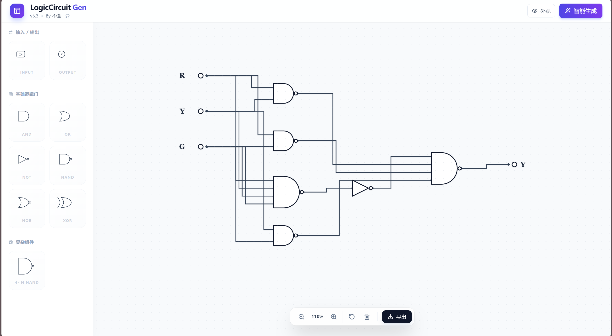
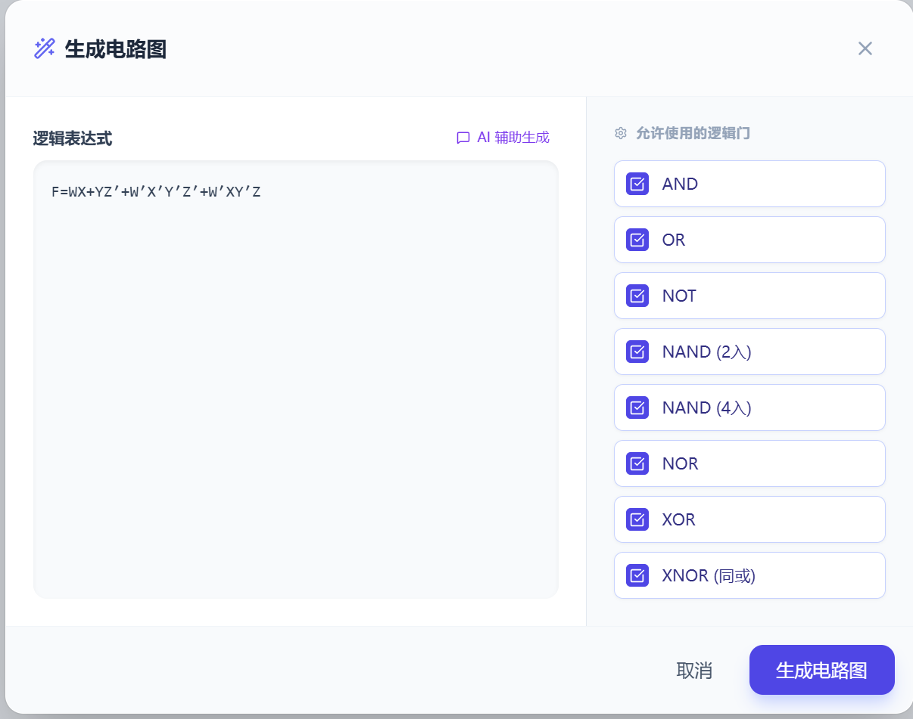
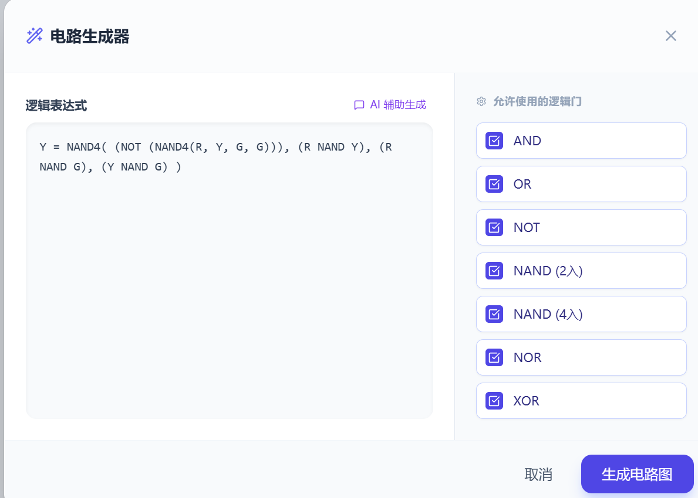
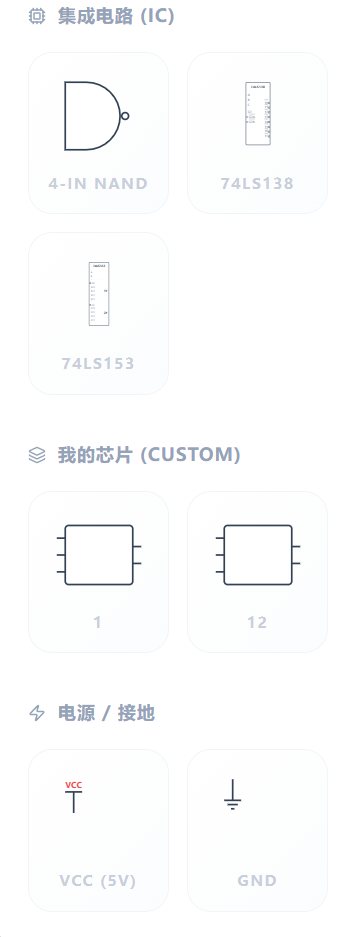

Logic Circuit Designer (逻辑电路自动生成器)\

A powerful, web-based logic circuit designer and generator. Supports drag-and-drop design, boolean expression synthesis, AI-assisted generation, and custom chip creation.

[English](#english) | [中文](#chinese) | [演示图片/typical drawing](#show_time) | [一键使用工具/One-click use](https://budoyh.github.io/logic-circuit-designer/)

🇬🇧 English Documentation

📖 Detailed User Manual

>Click the image above to read the complete PDF document online.

Introduction

Logic Circuit Gen is a React-based application designed for students, educators, and electronics enthusiasts. It allows users to visualize digital logic circuits, generate schematics automatically from boolean algebra, and create custom integrated circuits (ICs).

Key Features

🎨 Visual Designer: Intuitive drag-and-drop interface with Manhattan wire routing.

⚡ Smart Generation: Automatically synthesize circuit diagrams from boolean logic expressions (e.g., Y = AB + C).

🤖 AI Assistant: Built-in prompt generator to leverage ChatGPT/Claude for converting complex logic into compatible formats.

🧩 Custom Chips: Create your own reusable ICs with the "Custom Chip Wizard". Define input/output pins and chip width.

📦 Component Library:

Basic Gates: AND, OR, NOT, NAND, NOR, XOR, XNOR.

ICs: 74LS138 (Decoder), 74LS153 (Multiplexer), 4-Input NAND.

I/O: Switches, LEDs, VCC, GND.

🖼️ Export: High-quality PNG export for reports and documentation.

🛠️ Customization: Toggle "Minimalist Style" for academic-style nodes.

Quick Start Guide

Adding Components: Drag gates from the left sidebar onto the canvas.

Wiring: Click a connection point (port) on one component, then click a target port on another to create a wire.

Navigation:

Zoom: Use the mouse wheel.

Pan: Click and drag on empty space.

Deleting: Hover over a component and click the red delete icon that appears above it.

Advanced Features

1. Auto Generation (Smart Gen)

Convert boolean formulas directly into circuits.

Click the Auto Gen (Wand) button.

Enter equations like F = A'B + C.

Click Generate Circuit.

2. AI Assistant

If you have complex logic or natural language descriptions:

Open the Auto Gen panel.

Click AI Assistant.

Copy the generated prompt.

Send it to an LLM (ChatGPT, Claude, etc.).

Paste the returned code back into the generator input.

3. Custom Chips

Click New Chip.

Enter a name (e.g., "Full Adder").

Define Input pins (comma-separated, e.g., A, B, Cin).

Define Output pins (e.g., Sum, Cout).

Save and find your new chip in the My Chips section of the sidebar.

Installation

This project is built with React.

# 1. Clone the repository
git clone [https://github.com/budoyh/logic-circuit-designer.git](https://github.com/budoyh/logic-circuit-designer.git)

# 2. Install dependencies
npm install

# 3. Run development server
npm run dev

Author

Budoyh (不懂) Email: budo0422@outlook.com

GitHub: budoyh

🇨🇳 中文文档 (Chinese Documentation)

### 📖 详细使用手册

> 点击上方图片在线阅读完整 PDF 文档

简介

Logic Circuit Gen (逻辑电路生成器) 是一个基于 React 开发的网页版工具，专为学生、教师和电子爱好者设计。它支持可视化拖拽设计数字逻辑电路，能够通过布尔表达式自动生成电路图，并支持封装自定义芯片。

核心功能

🎨 可视化设计: 直观的拖拽操作，支持曼哈顿风格的自动连线。

⚡ 智能生成: 输入布尔表达式（如 Y = AB + C），自动合成对应的门电路图。

🤖 AI 辅助: 内置提示词生成器，帮助你利用 ChatGPT/Claude 将自然语言或复杂逻辑转换为生成器可识别的格式。

🧩 自定义芯片: 通过“新建芯片向导”封装自己的元器件，支持自定义引脚名称和芯片宽度。

📦 组件库:

基础门: AND, OR, NOT, NAND, NOR, XOR, XNOR。

集成电路 (ICs): 74LS138 (译码器), 74LS153 (数据选择器), 4输入 NAND。

电源/地: VCC, GND。

🖼️ 导出图片: 支持一键导出高清 PNG 图片，方便用于作业或论文。

🛠️ 外观设置: 支持切换“极简节点样式”（学术风格空心圆点）。

快速上手

添加元件: 从左侧工具栏按住并拖动元件到画布上。

连线: 点击元件的一个端口（圆点），然后点击另一个元件的端口即可连接。

画布操作:

缩放: 滚动鼠标滚轮。

平移: 按住画布空白处拖动。

删除: 鼠标悬停在元件上，点击上方出现的红色删除图标。

进阶功能

1. 智能生成 (Smart Gen)

直接将公式转换为电路。

点击顶部 智能生成 按钮。

输入公式，例如 F = A'B + C 或 Y = AND(A, B)。

点击 生成电路图。

2. AI 辅助生成

如果你有复杂的逻辑描述：

打开 智能生成 面板。

点击 AI 辅助生成。

复制弹出的提示词（Prompt）。

发送给 AI 模型（如 ChatGPT, Claude, Gemini）。

将 AI 返回的代码粘贴回输入框。

3. 自定义芯片 (My Chips)

点击顶部 新建芯片 按钮。

输入芯片名称（例如 "全加器"）。

定义左侧输入引脚（用逗号分隔，如 A, B, Cin）。

定义右侧输出引脚（如 Sum, Cout）。

保存后，新芯片将出现在左侧工具栏的 我的芯片 区域。

安装与运行

本项目使用 React 构建。

# 1. 克隆项目
git clone [https://github.com/budoyh/logic-circuit-designer.git](https://github.com/budoyh/logic-circuit-designer.git)

# 2. 安装依赖
npm install

# 3. 启动开发服务器
npm run dev

作者信息

作者: 不懂 (Budoyh)

联系邮箱: budo0422@outlook.com

GitHub: budoyh

Made with ❤️ by Budoyh

